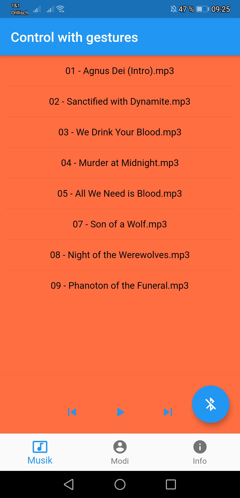
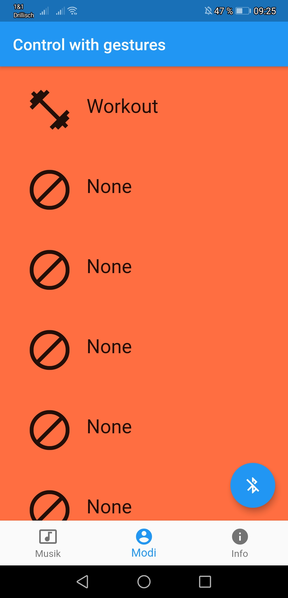
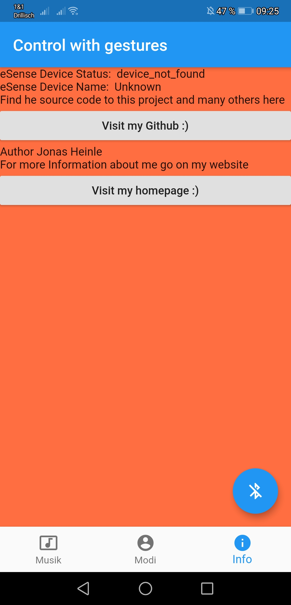

# ESense Earable Project
--------
About me
--------
 - graduated IT student interested in :
    - modern graphics hardware
    - real time applications 
    - IoT

-----------------------
Purpose of this project
-----------------------
Exploring earables provided by esense.io in context of pervasive computing
	

---------------------
What is used in here?
---------------------
- Flutter/Dart 
- ESense (esense.io)
 

--------------------
Algorithmic Analysis
--------------------
- Moving average for sensor events
- Async programming

---------------
Troubleshooting
---------------
- 

------------------
How to get started
------------------
just clone; run flutter get pub and upgrade; enjoy :)

------------------
Images
------------------

  
  
  

